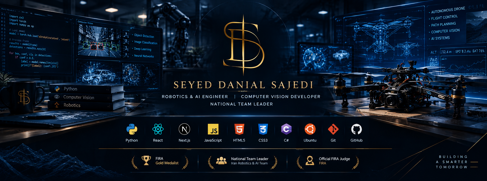

  

<h1 align="center">Seyed Danial Sajedi</h1>

  Frontend Developer • AI Enthusiast • Drone Systems Developer • 3D Designer

  Building intelligent systems, immersive web experiences and next-generation drone technologies.

---

## About Me

- AI & Robotics Developer
- Building Autonomous Drone Systems
- Frontend Developer (React / Next.js)
- Interested in 3D Web Experiences
- Linux & Open Source Enthusiast

---

## Tech Stack

  <b>Python</b> •
  <b>React</b> •
  <b>Next.js</b> •
  <b>JavaScript</b> •
  <b>HTML5</b> •
  <b>CSS3</b> •
  <b>C#</b> •
  <b>Git</b> •
  <b>GitHub</b> •
  <b>Ubuntu</b>

---

## AI & Robotics
Python • Machine Learning • Computer Vision

## Frontend Development
React • Next.js • JavaScript • HTML • CSS

## Software & Systems
C# • Ubuntu • Git 

## 3D & Design
Three.js • Blender • UI/UX

## 📄 Resume

  

## Connect With Me

<a href="mailto:sdanialsajedi@gmail.com">
  📧 Email
</a>
•
<a href="https://danialsajedi.com">
  🌐 Website
</a>
•
<a href="https://t.me/SDanial_Sajedi">
  ✈ Telegram
</a>
•
<a href="https://instagram.com/s_danial_sajedi">
  📷 Instagram
</a>

---

> "The future is built by those who create it."

